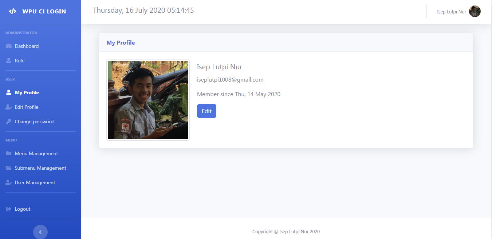
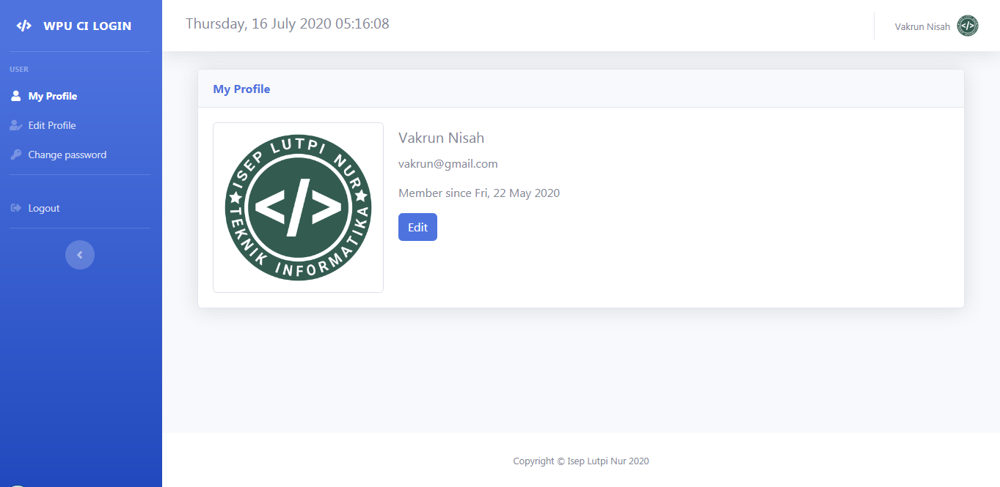

# Aplikasi sistem login dan menu manajemen
Aplikasi sistem login dan menu manajemen dengan menggunakan Framework Codeigniter 3 dan template SB Admin 2, berdasarkan tutorial di youtube [Web Programing Unpas](https://www.youtube.com/channel/UCkXmLjEr95LVtGuIm3l2dPg) Dalam Playlist [MEMBUAT SISTEM LOGIN LENGKAP MENGGUNAKAN CODEIGNITER](https://www.youtube.com/playlist?list=PLFIM0718LjIXU8ul9FiN-owk04cQKtHPw)

Instalasi seperti Database seperti Framework Codeigniter biasanya.
Ubah base url pada application config
<pre>
Administrator :
email: iseplutpi1008@gmail.com
passw: 1234

User:
email: vakrun@gmail.com
passw: 1234
</pre>

### Tampilan Administrator

### Tampilan User
